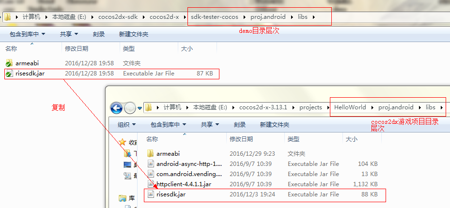
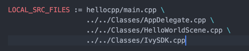

# RiseSDK for cocos2d-x
## Version: 3.2

## 1, 复制文件并初始化Activity

* 复制demo下IvySDK.h和IvySDK.cpp到项目所在源码目录下
<center></center>
* 复制demo下risesdk.jar到游戏项目同目录下
<center></center>

* 初始化activity
```java
    @Override
    protected void onCreate(Bundle savedInstanceState) {
        super.onCreate(savedInstanceState);
        Cocos.onCreate(this);
    }

    @Override
    protected void onResume() {
        super.onResume();
        Cocos.onResume(this);
    }

    @Override
    protected void onPause() {
        super.onPause();
        Cocos.onPause();
    }

    @Override
    protected void onDestroy() {
        Cocos.onDestroy();
        super.onDestroy();
    }

    @Override
    protected void onActivityResult(int requestCode, int resultCode, Intent data) {
        Cocos.onActivityResult(requestCode, resultCode, data);
        super.onActivityResult(requestCode, resultCode, data);
    }
```

* 如果您有使用proguard来混淆Java代码，需要添加以下规则：
```java
-dontwarn com.unity3d.**
-keep class com.android.client.** {
    <methods>;
}

-keep class android.support.** {
    *;
}

-keep class com.core.async.** {
    public *;
}

-keep class com.core.common.** {
    public *;
}

-keep class com.core.network.** {
    public *;
}

-keep class com.core.view.** {
    public *;
}

```

## 2, 添加IvySDK.cpp到Android.mk文件


##3，页面广告API

*全屏广告，需配置不同时机弹出的广告，以便于后台统计,我们预定义了以下几种时机弹出的广告：
```cpp
IvySDK::showFullAd(IvySDK::AD_POS_GAME_START); //游戏开始时
IvySDK::showFullAd(IvySDK::AD_POS_GAME_PAUSE); //游戏暂停
IvySDK::showFullAd(IvySDK::AD_POS_GAME_PASSLEVEL);//游戏过关
IvySDK::onQuit();//游戏退出并调用广告
IvySDK::showFullAd(IvySDK::AD_POS_GAME_CUSTOM); //您还使用自定义类型广告
```
注意：以上类型广告的弹出不要在activity的生命周期onResume()和onPause()中调用

*banner广告
```cpp
 static const int AD_POS_LEFT_TOP = 1;//左上角显示banner广告
 static const int AD_POS_MIDDLE_TOP = 3;//中间上部显示banner广告
 static const int AD_POS_RIGHT_TOP = 6;//右上角显示banner广告
 static const int AD_POS_MIDDLE_MIDDLE = 5;//中间显示banner广告
 static const int AD_POS_LEFT_BOTTOM = 2;//左下角显示banner广告
 static const int AD_POS_MIDDLE_BOTTOM = 4;//中间底部显示banner广告
 static const int AD_POS_RIGHT_BOTTOM = 7;//右下角显示banner广告
	
 IvySDK.showBanner("default", IvySDK::AD_POS_MIDDLE_BOTTOM); //居中显示banner广告
 IvySDK.closeBanner(); //关闭banner广告
 ```
##4, fackbook API和回调
如果你想使用fackbook相关功能，你应该按如下去做:
* 定义sms回调函数并注册
```cpp
void onReceiveSNSResult(int resultType, bool success, int extra) {
    switch(resultType) {
        case IvySDK::SNS_RESULT_LOGIN:
            if (success) {
                // now do your login logic, get profile, friends etc.
                const char* mestring = IvySDK::me();
                CCLOG("me string is %s", mestring);
            }
            break;

        case IvySDK::SNS_RESULT_LIKE:
            if (success) {
                CCLOG("thank you for like us.");
            }
            break;

        case IvySDK::SNS_RESULT_INVITE:
            if (success) {
                CCLOG("thank you invite your friends. you will receive 10 golds.");
            }
            break;

        case IvySDK::SNS_RESULT_CHALLENGE:
            if (extra > 3) {
                CCLOG("thank you challenge 3 friends, you will receive 10 golds.");
            }
            break;
    }
}

// 在初始化的时候注册你的回调函数
bool HelloWorld::init() {
  ...
  IvySDK::registerSNSCallback(onReceiveSNSResult);
  ...
}
```
* 注意:
SNS_RESULT* 定义在 namespace IvySDK,你不需要重新定义
```cpp
static const int SNS_RESULT_LOGIN = 1;
static const int SNS_RESULT_INVITE = 2;
static const int SNS_RESULT_CHALLENGE = 3;
static const int SNS_RESULT_LIKE = 4;
```

* 现在你可以使用如下fackbook相关接口:
```cpp
// fackbook登录
IvySDK::login();

//fackbook登出
IvySDK::logout();

//fackbook是否已经在登录状态
IvySDK::isLogin();

//fackbook点赞
IvySDK::like();

// fackbook邀请
IvySDK::invite();

// 挑战其他facebook好友
IvySDK::challenge("challenge you", "speed coming....");

// 获得玩家fackbook数据，返回json字符串 {"id":"xxx", "name":"xxx", "picture":"/sdcard/.cache/xxxx"}
const char* profileString = IvySDK::me();

// 获得玩家好友的facebook数据，返回json字符串数组: [{"id":"xxx", "name":"xxx", "picture":"/sdcard/.cache/xxxx"}, ...]
const char* friendString = IvySDK::friends();
```

## 5, 内付API和回调
当使用这个接口的时候，你应该按照如下去做：
* 注册你的支付回调函数
```c++
// 定义你的计费id
#define BILLING_ID_ACTIVE_GAME 1
#define BILLING_ID_BUY_CAR 2

//处理支付成功后的相应动作
static void onPaymentSuccess(int billId) {
	switch (billId) {
	case BILLING_ID_ACTIVE_GAME:
		CCLOG("game actived!");
    // do your logic here
		break;

    case BILLING_ID_BUY_CAR:
    // do your logic here
        break;
	}
}

//定义回调函数，这个函数应该是一个全局函数或者是类成员函数
void HelloWorld::onPaymentResult(int resultCode, int billingId) {
    CCLOG("billing %i result code %i", billingId, resultCode);
	switch (resultCode) {
	case IvySDK::PAYMENT_RESULT_SUCCESS:
		onPaymentSuccess(billingId);
		break;

	default:
		CCLOG("billing %i result code %i", billingId, resultCode);
		break;
	}
}

// 在初始化的时候注册你的回调函数
bool HelloWorld::init() {
  ...
  IvySDK::registerPaymentCallback(onPaymentResult);
  ...
}
```
* 注意
PAYMENT_RESULT* 已经被定义在 namespace IvySDK,你不需要重新定义
```cpp
static const int PAYMENT_RESULT_SUCCESS = 0;
static const int PAYMENT_RESULT_CANCEL = 1;
static const int PAYMENT_RESULT_FAILURE = 2;
```

* 调用计费接口
```c++
IvySDK::pay(BILLING_ID_ACTIVE_GAME);
```

## 6, 视频广告API和回调
Reward Ad是一个视频广告,当玩家观看视频后,你可以给予玩家金币/钻石/物品等作为奖励。

当你想使用这个功能的时候，你应该按照如下去做：
* 注册视频回调函数
```c++
#define REWARD_ID_GOLD 1
#define REWARD_ID_CAR 2

//定义回调函数，这个函数应该是一个全局函数或者是类成员函数
void onRewardAdResult(bool success, int rewardId) {
  if (success) {
    CCLOG("receive reward %i", rewardId);
    // do your logic here
    switch(rewardId) {
      case REWARD_ID_CAR:
      // do your logic
      break;

      case REWARD_ID_GOLD:
      //do your logic
      break;

      ...
    }
  }
}

// 在初始化的时候注册你的回调函数
bool HelloWorld::init() {
  ...
  IvySDK::registerRewardAdCallback(onFreecoinResult);
  ...
}
```
* 调用视频接口
```c++
// 判断是否支持视频播出
bool has = IvySDK::hasRewardAd();
if (has) {
  IvySDK::showRewardAd(REWARD_ID_GOLD);
}
```
## 7, 其他
下载图片并且缓存(没有回调)
```cpp
const char* path = IvySDK::cacheUrl("http://img.google.com/xxxxxx.png");
// do your works, you can query the path whether exists or not after 5 seconds
```
如果你想缓存一个url并且让系统给你一个回调，你应该这样做：
* 定义回调函数
```cpp
const int TAG_BITMAP = 1;

void onCacheUrlResult(int tag, bool success, const char* path) {
  switch(tag) {
    case TAG_BITMAP:
    CCLOG("download bitmap result success ? %d, path is %s", success ? 1 : 0, path);
    break;
  }
}

// 在初始化的时候注册你的回调函数
bool HelloWorld::init() {
  ...
  IvySDK::registerCacheUrlCallback(onCacheUrlResult);
  ...
}
```

* 下载
```cpp
// download a bitmap and cache it with callback
IvySDK::cacheUrl(TAG_BITMAP, "http://img.google.com/xxxxxx.png");
```

* other misc
```cpp
// get system configurations
const char* config = IvySDK::getConfig(IvySDK::CONFIG_KEY_APP_ID);
int appId = itoa(config);

// the configurations are defined in namespace IvySDK
// you should NOT define these again
static const int CONFIG_KEY_APP_ID = 1;
static const int CONFIG_KEY_LEADER_BOARD_URL = 2;
static const int CONFIG_KEY_API_VERSION = 3;
static const int CONFIG_KEY_SCREEN_WIDTH = 4;
static const int CONFIG_KEY_SCREEN_HEIGHT = 5;
static const int CONFIG_KEY_LANGUAGE = 6;
static const int CONFIG_KEY_COUNTRY = 7;
static const int CONFIG_KEY_VERSION_CODE = 8;
static const int CONFIG_KEY_VERSION_NAME = 9;
static const int CONFIG_KEY_PACKAGE_NAME = 10;

// query an app whether installed or not
const char* appPackageName = "com.yes.good";
if (IvySDK::hasApp(appPackageName)) {
  // launch this app
  IvySDK::launchApp(appPackageName);
} else {
  // goto play store for this app
  IvySDK::getApp(appPackageName);
}
```

## 8, Congratulations, done.
 You will see some toasts when you run your game in your android phone or emulator:
<center></center>
