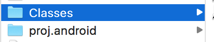
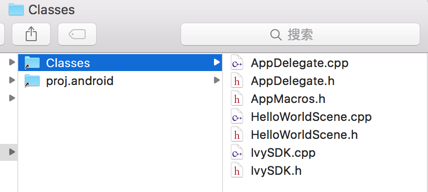
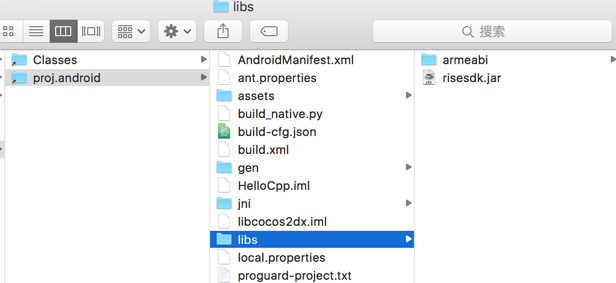

# RiseSDK for cocos2d-x
## 1, Copy files and init in Activity

* copy Classes and proj.android to your Cocos2d-x project folder corresponding
* before:
<center></center>
* after:
<center></center>
<center></center>

* init in your main activity
```java
    @Override
    protected void onCreate(Bundle savedInstanceState) {
        super.onCreate(savedInstanceState);
        Cocos.onCreate(this);
    }

    @Override
    protected void onResume() {
        super.onResume();
        Cocos.onResume(this);
    }

    @Override
    protected void onPause() {
        super.onPause();
        Cocos.onPause();
    }

    @Override
    protected void onDestroy() {
        Cocos.onDestroy();
        super.onDestroy();
    }

    @Override
    protected void onActivityResult(int requestCode, int resultCode, Intent data) {
        Cocos.onActivityResult(requestCode, resultCode, data);
        super.onActivityResult(requestCode, resultCode, data);
    }
```

* if you use proguard to obfuscate your java source code, you should add these rules to your proguard rules file:
```java
-keep class com.risesdk.client.** {
    <methods>;
}

-keep class android.support.** {
    *;
}

-keep class com.risecore.async.** {
    public *;
}

-keep class com.risecore.common.** {
    public *;
}

-keep class com.risecore.network.** {
    public *;
}

-keep class com.risecore.view.** {
    public *;
}
```

## 2, add IvySDK.cpp to your Android.mk file


## 3, ADs
This module will make these things done:
* show banner
* close banner
* show full screen ad
* make the player to share the game to his friends
* let the player to give your game a 5-star-rating
* track the player's behaviors for analytics

call these functions when you want
```c++
//show pass level full screen ad when you want
IvySDK::showInterstitial(IvySDK::AD_POS_GAME_PASSLEVEL);

// show pause ad when you want
IvySDK::showInterstitial(IvySDK::AD_POS_GAME_PAUSE);

// show banner at the top center position of your phone
IvySDK::showBanner(IvySDK::AD_POS_MIDDLE_TOP);

// close banner when needed
IvySDK::closeBanner();

// when you want to quit the game
IvySDK::onQuit();

// ask the player to share your game with his friends
IvySDK::share();

// ask the player to give you a 5-star-rating
IvySDK::rateUs();

// show more game to the player
IvySDK::showMoreGame();

// when you want to track the player behavior
IvySDK::trackEvent("your category", "your action", "your label", 1);

// get your custom data from server, return "{}" default
const char* data = IvySDK::getExtraData();
```
* Notice
AD_POS* are defined in namespace IvySDK
you should NOT define these again
```cpp
// these for banner ads
static const int AD_POS_LEFT_TOP = 1;
static const int AD_POS_MIDDLE_TOP = 3;
static const int AD_POS_RIGHT_TOP = 6;
static const int AD_POS_MIDDLE_MIDDLE = 5;
static const int AD_POS_LEFT_BOTTOM = 2;
static const int AD_POS_MIDDLE_BOTTOM = 4;
static const int AD_POS_RIGHT_BOTTOM = 7;

// these for interstitial ads
static const char* AD_POS_GAME_START = "start";
static const char* AD_POS_GAME_PAUSE = "pause";
static const char* AD_POS_GAME_PASSLEVEL = "passlevel";
static const char* AD_POS_GAME_CUSTOM = "custom";
```

## 4, In-App Billing
When you want to use IAP, you should do this:
* register your payment callback
```c++
// define your bill ids
#define BILLING_ID_ACTIVE_GAME 1
#define BILLING_ID_BUY_CAR 2
... etc.

static void onPaymentSuccess(int billId) {
	switch (billId) {
	case BILLING_ID_ACTIVE_GAME:
		CCLOG("game actived!");
    // do your logic here
		break;

    case BILLING_ID_BUY_CAR:
    // do your logic here
        break;
	}
}

// define your callback function, this should be a global function or a member function of a class
void HelloWorld::onPaymentResult(int resultCode, int billingId) {
    CCLOG("billing %i result code %i", billingId, resultCode);
	switch (resultCode) {
	case IvySDK::PAYMENT_RESULT_SUCCESS:
		onPaymentSuccess(billingId);
		break;

	default:
		CCLOG("billing %i result code %i", billingId, resultCode);
		break;
	}
}

// call register in your initialize function
bool HelloWorld::init() {
  ...
  IvySDK::registerPaymentCallback(onPaymentResult);
  ...
}
```
* Notice
PAYMENT_RESULT* are defined in namespace IvySDK:
you should NOT define these again
```cpp
static const int PAYMENT_RESULT_SUCCESS = 0;
static const int PAYMENT_RESULT_CANCEL = 1;
static const int PAYMENT_RESULT_FAILURE = 2;
```

* call doBilling when you want
```c++
IvySDK::doBilling(BILLING_ID_ACTIVE_GAME);
```

## 5, Reward AD
Reward Ad is a video ad that when the player saw it, you will give him some golds/items/diamonds etc.

when you want to use reward ad, you should do this:
* register your reward ad callback
```c++
#define REWARD_ID_GOLD 1
#define REWARD_ID_CAR 2
... etc.

// define your callback function, this should be a global function or a member function of a class
void onFreecoinResult(bool success, int rewardId) {
  if (success) {
    CCLOG("receive reward %i", rewardId);
    // do your logic here
    switch(rewardId) {
      case REWARD_ID_CAR:
      // do your logic
      break;

      case REWARD_ID_GOLD:
      //do your logic
      break;

      ...
    }
  }
}

// call register in your initialize function
bool HelloWorld::init() {
  ...
  IvySDK::registerFreecoinCallback(onFreecoinResult);
  ...
}
```
* call showFreeCoin when you want
```c++
// determine whether the reward ad is available
bool has = IvySDK::hasFreeCoin();
if (has) {
  // launch reward ad for gold
  IvySDK::showFreeCoin(REWARD_ID_GOLD);
}
```

## 6, SNS
This module can make these things done:
* login with facebook
* logout
* like your facebook page
* let the player invite his friends
* let the player challenge his friends
* get friends list
* get player's profile

If you want to use SNS, you can do this:
* define sns callback and register it
```cpp
void onReceiveSNSResult(int resultType, bool success, int extra) {
    switch(resultType) {
        case IvySDK::SNS_RESULT_LOGIN:
            if (success) {
                // now do your login logic, get profile, friends etc.
                const char* mestring = IvySDK::me();
                CCLOG("me string is %s", mestring);
            }
            break;

        case IvySDK::SNS_RESULT_LIKE:
            if (success) {
                CCLOG("thank you for like us.");
            }
            break;

        case IvySDK::SNS_RESULT_INVITE:
            if (success) {
                CCLOG("thank you invite your friends. you will receive 10 golds.");
            }
            break;

        case IvySDK::SNS_RESULT_CHALLENGE:
            if (extra > 3) {
                CCLOG("thank you challenge 3 friends, you will receive 10 golds.");
            }
            break;
    }
}

// call register in your initialize function
bool HelloWorld::init() {
  ...
  IvySDK::registerSNSCallback(onReceiveSNSResult);
  ...
}
```
* Notice:
SNS_RESULT* are defined in namespace IvySDK:
you should NOT define these again
```cpp
static const int SNS_RESULT_LOGIN = 1;
static const int SNS_RESULT_INVITE = 2;
static const int SNS_RESULT_CHALLENGE = 3;
static const int SNS_RESULT_LIKE = 4;
```

* and then you can do this when needed:
```js
// login
IvySDK::login();

// log out
IvySDK::logout();

// indicates if the player logged in
IvySDK::isLogin();

// let the player to like you
IvySDK::like();

// let the player to invite his friends
IvySDK::invite();

// let the player to challenge his friends
IvySDK::challenge("challenge you", "speed coming....");

// get the player profile, the result is a json string  {"id":"xxx", "name":"xxx", "picture":"/sdcard/.cache/xxxx"}
const char* profileString = IvySDK::me();

// get the player friends profiles, the result is a json array string: [{"id":"xxx", "name":"xxx", "picture":"/sdcard/.cache/xxxx"}, ...]
const char* friendString = IvySDK::friends();
```

## 7, NativeAds
When you want to show some ads in your loading stage or pause game stage, you can use this type of ad. This Ad will show in screen position that measured by percentage of the screen height that you want. see blow:
```cpp
// show native ad in screen with y position of 80 percent of screen height
IvySDK::showNativeAd("loading", 80);

// hide native ad when you pass the loading stage
IvySDK::hideNativeAd("loading");

// you can check is there exists any native ad
if (IvySDK::hasNativeAd("loading")) {
  // show loading stage with native ad
} else {
  // show loading stage without native ad
}
```

## 8, Misc
* download something and cache it (async)
* get system configurations
* query whether installed an app or not
* launch an app
* goto play store for an app

Download a bitmap and cache it (without callback)
```cpp
const char* path = IvySDK::cacheUrl("http://img.google.com/xxxxxx.png");
// do your works, you can query the path whether exists or not after 5 seconds
```

If you want to cache an url and let the system give you a callback, you can do this
* define callback
```cpp
const int TAG_BITMAP = 1;

void onCacheUrlResult(int tag, bool success, const char* path) {
  switch(tag) {
    case TAG_BITMAP:
    CCLOG("download bitmap result success ? %d, path is %s", success ? 1 : 0, path);
    break;
  }
}

// call register in your initialize function
bool HelloWorld::init() {
  ...
  IvySDK::registerCacheUrlCallback(onCacheUrlResult);
  ...
}
```

* download
```cpp
// download a bitmap and cache it with callback
IvySDK::cacheUrl(TAG_BITMAP, "http://img.google.com/xxxxxx.png");
```

* other misc
```cpp
// get system configurations
const char* config = IvySDK::getConfig(IvySDK::CONFIG_KEY_APP_ID);
int appId = itoa(config);

// the configurations are defined in namespace IvySDK
// you should NOT define these again
static const int CONFIG_KEY_APP_ID = 1;
static const int CONFIG_KEY_LEADER_BOARD_URL = 2;
static const int CONFIG_KEY_API_VERSION = 3;
static const int CONFIG_KEY_SCREEN_WIDTH = 4;
static const int CONFIG_KEY_SCREEN_HEIGHT = 5;
static const int CONFIG_KEY_LANGUAGE = 6;
static const int CONFIG_KEY_COUNTRY = 7;
static const int CONFIG_KEY_VERSION_CODE = 8;
static const int CONFIG_KEY_VERSION_NAME = 9;
static const int CONFIG_KEY_PACKAGE_NAME = 10;

// query an app whether installed or not
const char* appPackageName = "com.yes.good";
if (IvySDK::hasApp(appPackageName)) {
  // launch this app
  IvySDK::launchApp(appPackageName);
} else {
  // goto play store for this app
  IvySDK::getApp(appPackageName);
}
```

## 9, Congratulations, done.
 You will see some toasts when you run your game in your android phone or emulator:
<center></center>
